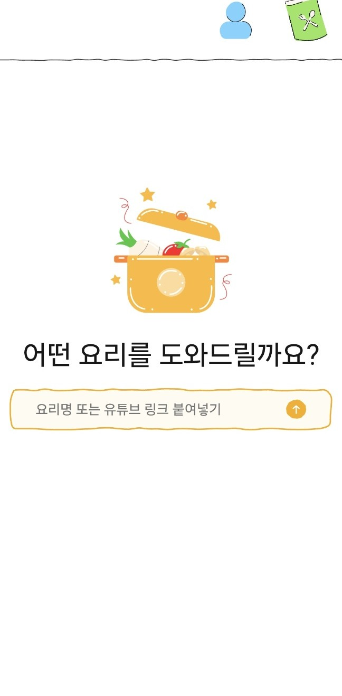
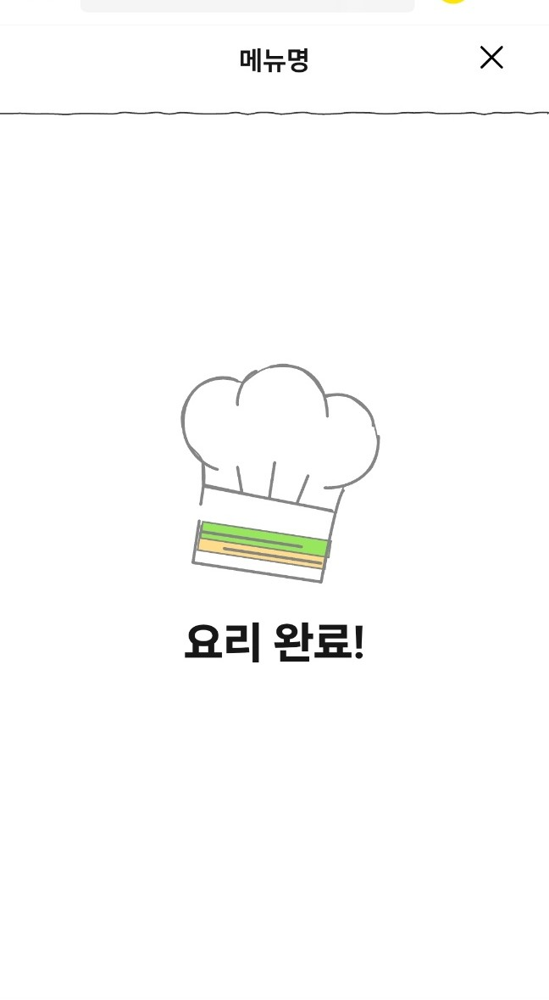

# 🍳 먹구살구 (리얼타임 요리보조)

요리를 더 쉽고, 재밌고, 인터랙티브하게 만들어주는 당신만의 AI 수셰프입니다. 이 프로젝트는 **Next.js 16**과 **React 19**를 활용하여 끊김 없는 실시간 요리 보조 경험을 제공합니다.

## ✨ 주요 기능

- **🎙️ 실시간 요리 가이드**: 대화형 단계별 요리 지침을 제공합니다 (`/cooking`).
- **🥗 요리 준비 확인**: 재료가 모두 준비되었는지, 요리를 시작할 준비가 되었는지 확인합니다 (`/ready`).
- **👤 사용자 프로필**: 요리 취향과 기록을 관리합니다 (`/profile`).
- **🎉 요리 결과**: 당신의 요리 성과를 확인하고 공유하세요 (`/result`).
- **✨ 인터랙티브 애니메이션**: Lottie 애니메이션을 활용한 생동감 넘치는 UI를 제공합니다.

## 실행 화면

|                 메인 화면                  |                 요리 준비                  |
| :----------------------------------------: | :----------------------------------------: |
|  |  |
|               **요리 진행**                |               **요리 결과**                |
|  |  |


## 🛠️ 기술 스택

- **프레임워크**: [Next.js 16](https://nextjs.org/) (App Router)
- **UI 라이브러리**: [React 19](https://react.dev/)
- **언어**: [TypeScript](https://www.typescriptlang.org/)
- **스타일링**: CSS Modules / Global CSS
- **애니메이션**: [Lottie React](https://github.com/Gamote/lottie-react)

## 🚀 시작하기

1.  **레포지토리 클론:**

    ```bash
    git clone <repository-url>
    cd frontEnd
    ```

2.  **패키지 설치:**

    ```bash
    npm install
    # 또는
    yarn install
    ```

3.  **개발 서버 실행:**

    ```bash
    npm run dev
    # 또는
    yarn dev
    ```

4.  **브라우저 열기:**
    [http://localhost:3000](http://localhost:3000)으로 접속하여 요리를 시작해보세요!

## 📂 프로젝트 구조

```
src/
├── app/
│   ├── (with-header)/   # 공통 헤더 레이아웃이 적용된 페이지들
│   ├── cooking/         # 메인 요리 보조 인터페이스
│   ├── profile/         # 사용자 프로필 설정
│   ├── ready/           # 요리 전 체크리스트 및 준비
│   ├── result/          # 요리 세션 요약 및 결과
│   └── api/             # 백엔드 API 연동
├── components/          # 재사용 가능한 UI 컴포넌트
└── util/                # 유틸리티 함수
```

---

_Made with ❤️ for the Realthon Team 3_
